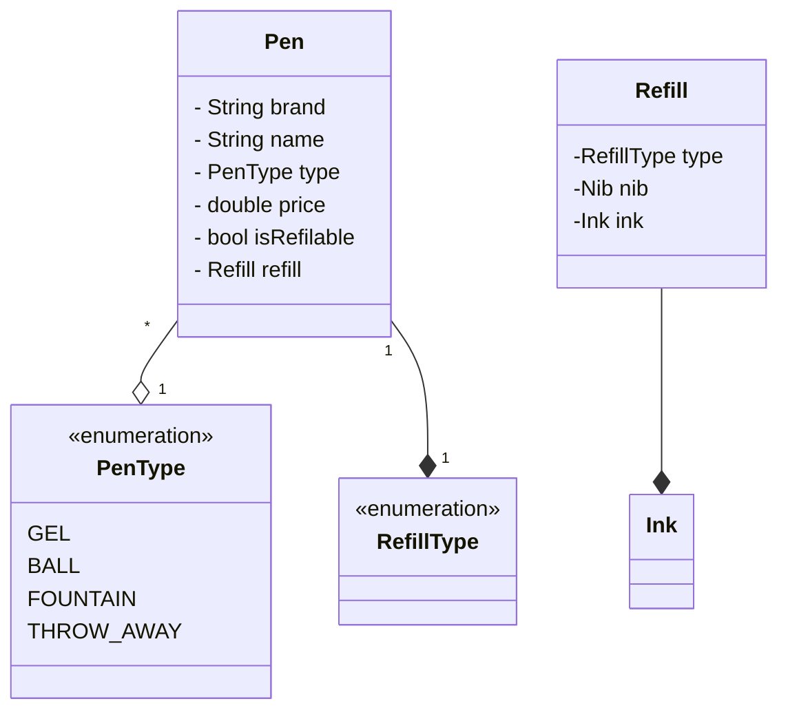

# Design A Pen

* Abstract Problem Statement
  * Design a Pen
  * Design a TicTacToe
* Asking questions
  * Current scope -
    * Overview
    * Definition
    * Attributes and Behavior
  * Future Scope
    * How does the requirements down the road look like
  *Behavior
      * How does user interact with the system?

## Requirements

* A pen is anything that can write.
* Pen can be Gel, Ball, Fountain, Marker.
* Ball Pen and Gel Pen have a Ball Pen Refill and a Gel Pen Refill respectively to write.
* A refil has a tip and an ink.
* Ink can be of different colour
* A fountain pen has an Ink.
* Refil has a radius.
* For fountain pen, its tip has a radius.
* Each pen can write in a different way.
* Some pens write in the same way.
* Every pen has a brand and a name.
* Some pens may allow refilling while others might not.

## Entities and Attributes
* Pen
  * Brand
  * name
  * Type - Ball, Gel, Fountain, Throwaway
  * Price
  * Refillable
* Refill
  * Type - Gel, Ball
  * Ink
  * Nib
  * Refillable
* Ink
  * Color
  * Brand
  * Type - Gel, Ball, Fountain
* Nib
  * radius
  * Type - Gold, Silver, Platinum
  * 

### Different types of pen
* BallPen
  * Type - `Ball`
  * Refillable - `Yes`
  * Refill
    * `Type` - `Ball`
    * `Refillable` - `Yes`
  * Ink
  * Nib
* Gel Pen
  * Type - `Gel`
  * Refillable - Yes
  * Refill
    * Type - `Gel`
    * Refillable - Yes
* Throwaway Pen
  * Type - `Throwaway`
  * Refillable - `No`
  * Refill
    * `Type` - `Ball`
    * `Refillable` - `No`
  * Ink
  * Nib
* Fountain Pen
  * Type - Fountain
  * Refillable - Yes
  * Ink
  * Nib

## Pen as the God Class

## Improvements
* SRP is not violated
* OCP is not violated
* Null values/checks no more

## Problems
* Liscove